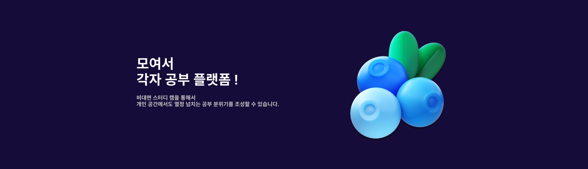
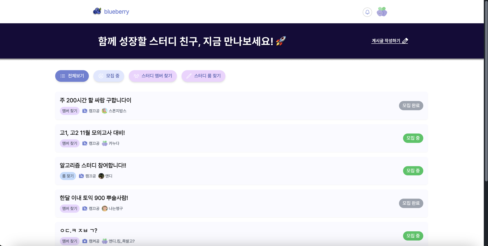
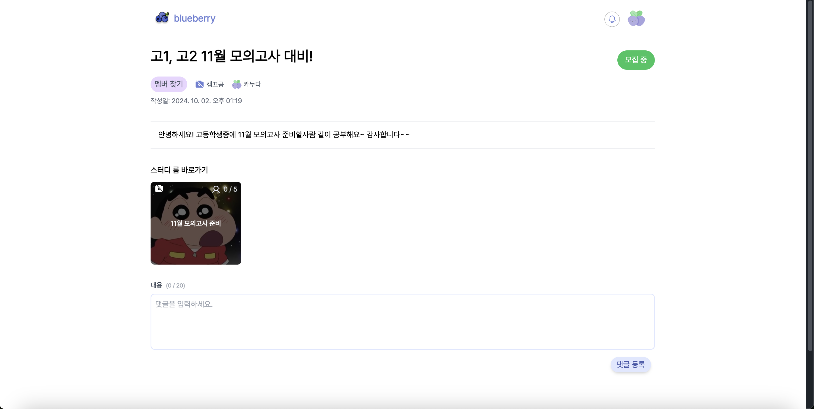
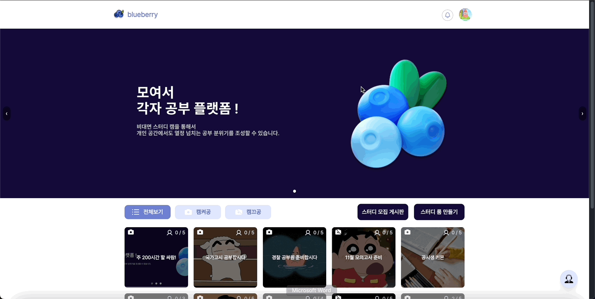

**✅ Last Updated 2024-10-8**

 

# 🫐 Blueberry

**🔗 [서비스 바로가기↗](https://blueberry826.com/)** | 2024-10-11 서비스 종료예정  
**🎥 [Demo](https://youtu.be/sR68VYhHsxg)** | YouTube 시연영상  
**📚 [Wiki](https://github.com/100-hours-a-week/5-bluestarfish-blueberry-be/wiki)** | 프로젝트 상세

 

💻 **Github**  
[Frontend Repository](https://github.com/100-hours-a-week/5-bluestarfish-blueberry-fe)  
[Backend Repository](https://github.com/100-hours-a-week/5-bluestarfish-blueberry-be)

     

# 🔵 Team Introduction - 🌊 Blue Starfish 🌊

|                        Leader                        |                           FE                           |                          FE                           |                           BE                            |                           BE                            |
|:----------------------------------------------------:|:------------------------------------------------------:|:-----------------------------------------------------:|:-------------------------------------------------------:|:-------------------------------------------------------:|
|  |  |  |  |  | 
|       [Ian](https://github.com/BenchPress200)        |          [Ariel](https://github.com/yeji0214)          |          [Andy](https://github.com/boozeal)           |        [Hailey](https://github.com/hyeonheeeee)         |         [Kanuda](https://github.com/DohunHyun)          |

 

> 저희 팀은 이렇게 협업합니다 !

- 데일리 스크럼을 통한 일관된 전진
- 스프린트 회고를 통한 목표정렬 및 집중
- 문제상황에 대한 즉각적인 소통 중시
- 계획시간과 실행시간의 확실한 분리

     

# 🟣 Primary Features

 

### N 대 N 스터디 캠

 

### 텍스트 채팅

 

### 스터디 모집 커뮤니티

 

### 친구관리

     

# 🔵 Project Architecture

     

# 🟣 Tech Stack

 

### Frontend

 

### Backend

 

### Database

 

### Infrastructure

     

# 🔵 etc.

 

**📮 bluestarfish246@gmail.com**

     
